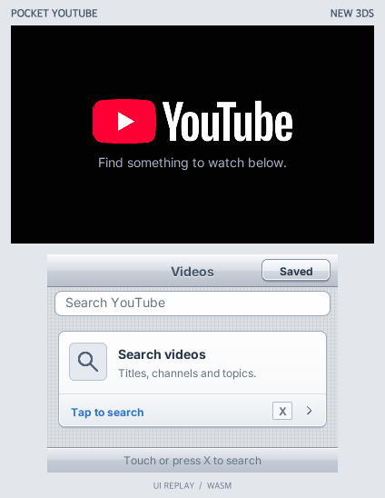
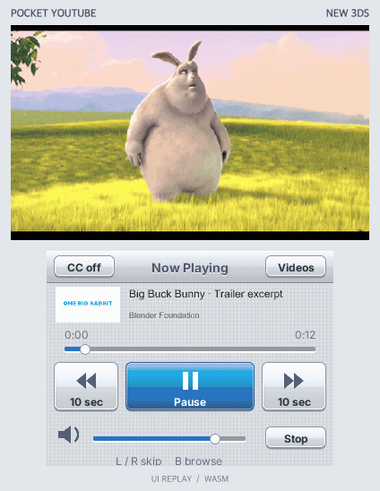

# Pocket YouTube

YouTube on PSP, PS Vita and New Nintendo 3DS, with a Mac companion.

## New Nintendo 3DS

Watch on the **400×240 upper display** and use the **320×240 touch display**
for search, browsing and playback controls. The iOS-inspired keyboard clears
its pressed state on release; hold backspace to delete or hold space to move
the cursor. Search results load ahead of the scroll position, with cached
titles and thumbnails.

**Hold a video row to save it on the 3DS SD card.** The Saved screen shows
conversion progress, SD transfer progress and completed downloads. Saved
videos play, pause and seek with the companion disconnected. **CC** opens
caption controls and language selection; video downloads include the selected
captions, and **Save captions to SD** exports a separate WebVTT file.

<table>
  <tr><th>Search and automatic loading</th><th>Playback and browsing</th></tr>
  <tr>
    <td></td>
    <td></td>
  </tr>
</table>

These GIFs record the current application in the PocketJS WASM renderer with
sample search results and a video fixture. They show the dual-screen interface;
hardware decoding and Wi-Fi timing require a device run. Footage: **Big Buck
Bunny**, © 2008 Blender Foundation, [CC BY 3.0](https://peach.blender.org/about/).
[Recording source and reproduction steps](docs/media/README.md).

The companion worker handles YouTube, TLS and encoding. **New 3DS MVD decodes
H.264**, PICA200 displays video and NDSP plays audio. The device owns touch,
scrolling, pause, volume and seek previews. Browsing keeps the video mounted;
a scrub sends one seek when the touch ends.

With homebrew, ftpd and DSP firmware set up on a New 3DS:

```sh
bun run setup
bun run 3ds                        # → dist/3ds/pocket-youtube.3dsx
bun run deploy:3ds --host <3DS-IP> --ftp-port 5000
# Exit ftpd and launch Pocket YouTube from Homebrew Launcher.
bun run serve:3ds --device <3DS-IP>
```

The Mac and console must share a LAN. The installer preserves pairing, backs
up the previous launcher and verifies uploaded bytes. `bun run 3ds --cia`
also builds an installable CIA. See [the 3DS guide](docs/3DS.md) for toolchain
requirements, DSP setup, controls and the companion architecture.

## PSP

[](https://pub-ddde9ba138d04a9a9f922aa1fda6f855.r2.dev/pocketjs/pocket-youtube-real-psp-7ae0b36c.mp4)

▶ **[Watch it running on a real PSP (video, 75 s, sound on)](https://pub-ddde9ba138d04a9a9f922aa1fda6f855.r2.dev/pocketjs/pocket-youtube-real-psp-7ae0b36c.mp4)**

The PSP's 802.11b radio cannot reach the modern web, so the app splits at the
network boundary: a Mac companion process owns DNS, TLS, yt-dlp and H.264,
and the handheld — running [PocketJS](https://github.com/pocket-stack/pocketjs) —
owns presentation: a 60 Hz Solid UI, a 512×128 CLUT8 video plane at 12 fps,
and a 44.1 kHz audio thread. Search with the system on-screen keyboard,
browse host-rendered rows (CJK titles included), play, pause, seek.

The full engineering story — the `.pkst` ring container you can `ls`, the
per-frame palette quantization, the GPU race that only real silicon could
show — is on the blog: [Pocket YouTube: Streaming YouTube to a PSP over a
USB Cable](https://pocketjs.dev/blog/pocket-youtube/).

### How it works

```text
Mac (host/serve.ts)                     PSP (app/, PocketJS)
├─ yt-dlp     search · resolve 720p    ├─ Solid UI: search / rows / player
├─ ffmpeg ×2  video → 512×128 CLUT8    ├─ videoTick(): ≤26 KB file I/O per
│             audio → 22.05 kHz PCM     │   60 Hz tick, main thread only
├─ quantizer  median cut + dither      ├─ video plane: one GE texture,
└─ writes pocket-svc/youtube/           │   committed only in the GE-idle gap
   ├─ in/out.jsonl   command mailbox   └─ audio thread: native 44.1 kHz,
   ├─ thumbs/*.img   result rows           2× software upsample, no allocator
   └─ media/*.pkst   THE STREAM
            ▲
            └── PSPLINK usbhostfs mounts this directory as host0:/
```

One preallocated 1,058,144-byte file per stream — a ring buffer that happens
to live on a filesystem. The writer publishes sequence numbers after
payloads; the reader chases the tail and discards torn frames. Pause is
`SIGSTOP` on ffmpeg; seek is a respawn plus an epoch bump.

### Requirements

- A PSP with custom firmware and [PSPLINK](https://github.com/pspdev/psplinkusb)
  (`usbhostfs_pc` on the Mac side), connected over USB
- [Bun](https://bun.sh), [yt-dlp](https://github.com/yt-dlp/yt-dlp) and
  [ffmpeg](https://ffmpeg.org) on the Mac (`brew install yt-dlp ffmpeg`).
  Use **yt-dlp 2026.08.19 or newer**, with its matching `yt-dlp-ejs` package
  (included by Homebrew). Update an existing install with `brew upgrade yt-dlp`.
  The companion supplies its Bun executable for YouTube's JavaScript
  challenges and ignores user yt-dlp configuration. Video and audio are
  resolved as separate tracks, with a muxed source as fallback.
  FFmpeg must support HTTP `request_size` and `initial_request_size`
  (`ffmpeg -h protocol=http`; validated with 8.1.1).
- The PocketJS PSP toolchain (installed by `bun run bootstrap`)

### Quick start

```sh
git clone --recursive https://github.com/pocket-stack/pocket-youtube
cd pocket-youtube
bun run setup        # vendor install + node_modules links
bun run bootstrap    # install the pinned PSP toolchain if missing
bun run psp -r       # → dist/EBOOT.PBP

# terminal 1 — mount a directory on the PSP as host0:
usbhostfs_pc -b 10000 <your usbhostfs root>

# terminal 2 — the companion service (network + pixels)
bun run serve -- --dir <your usbhostfs root>

# run the EBOOT on the device (XMB from a Memory Stick, or ldstart the
# .prx from crates/pocket-youtube-psp/target/... over PSPLINK)
```

The app boots to `CONNECT USB`, handshakes with the service through the
mailbox, and you are searching. `△` opens the keyboard, `START` searches,
`○` plays, `◁/▷` seek ±10 s.

## PS Vita

The Vita build uses the PocketJS Vita host and its TCP transport over WiFi.
The companion sends a **512×256 CLUT8 video plane at up to 24 fps** and
**44.1 kHz stereo PCM**. Result cards use density-2 text; the UI retains its
480×272 logical viewport on the 960×544 display.

With VitaSDK installed at `$VITASDK` or `~/vitasdk`, run:

```sh
bun run vita          # → dist/vita/main.vpk; install with VitaShell
bun run serve:vita    # companion TCP service + discovery on the same LAN
```

## Development

```sh
bun run build              # PSP bundle + pak via the pocket.json plan
bun run typecheck          # app and build-tool TypeScript
bun run test               # host pipeline, TCP transport, and deterministic sim journeys
bun run check:platforms    # capability + app TypeScript checks (PSP and Vita)
bun run test:3ds           # companion media, search pages and dual-screen UI
bun run demo:3ds           # regenerate the README GIFs with fixture services
bun run cover              # regenerate the XMB ICON0/PIC1 art
```

The sim journeys boot the real bundle against PocketJS's wasm core with a
canned host driver — the on-screen-keyboard paths are derived from the
actual key layout, and one journey types by touch. No device required.

The media tests run FFmpeg against a local HTTP server that rejects
unbounded byte ranges. Playback starts after **both video and audio reach
the stream**, with a 15-second startup timeout. Decoder failures return an
error instead of reporting normal end-of-stream or leaving a 0:00 player.
If a configured proxy can search YouTube but fails on its video CDN, test
the companion without that proxy; the metadata and media connections are
separate requests.

PocketJS itself is vendored as a git submodule (`vendor/pocketjs`), same as
[pocket-figma](https://github.com/pocket-stack/pocket-figma); this repo owns
the app, the companion service, and the PSP/Vita/3DS build entry points.

The framework is pinned to **PocketJS `3b39f4d3`**, including native 3DS media, an SD download worker, local seeking,
timed captions and shared touch-keyboard support. **This build requires a new
3DS launcher with host ABI 11.** The PSP crate
and `vendor/quickjs-rs` share the framework's **QuickJS revision `ba5bdd0`**;
the PSP build passes `-O2` for the C interpreter, matching the upstream
toolchain. After changing branches or updating the submodule pins, run
`bun run setup` to restore the recorded revisions and locked JS dependencies.

Release validation includes `bun run psp -r`, `bun run vita` and `bun run 3ds --cia`. The Wasm
journeys use a canned companion; USB/WiFi streaming, audio, and device input
need a separate run on the corresponding hardware.

## License

MIT
